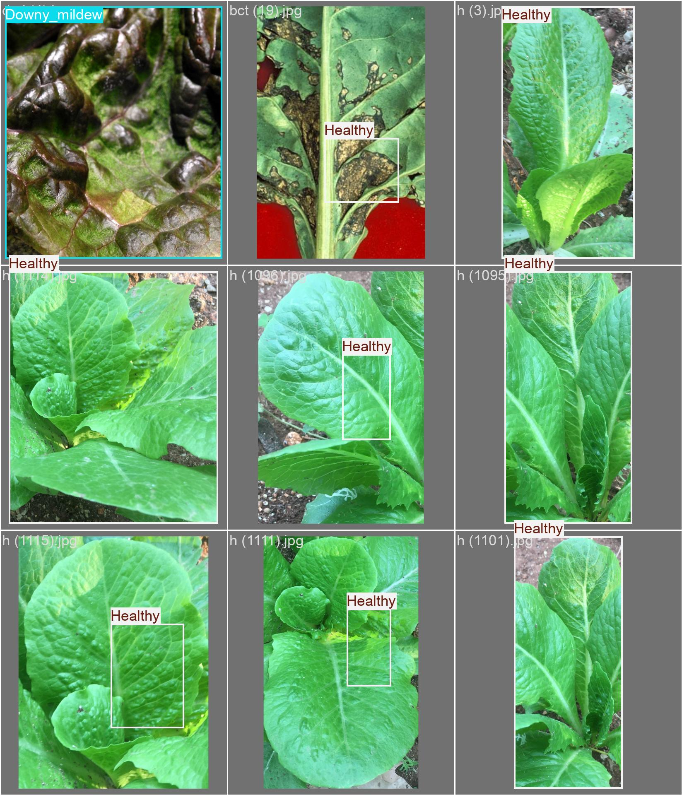
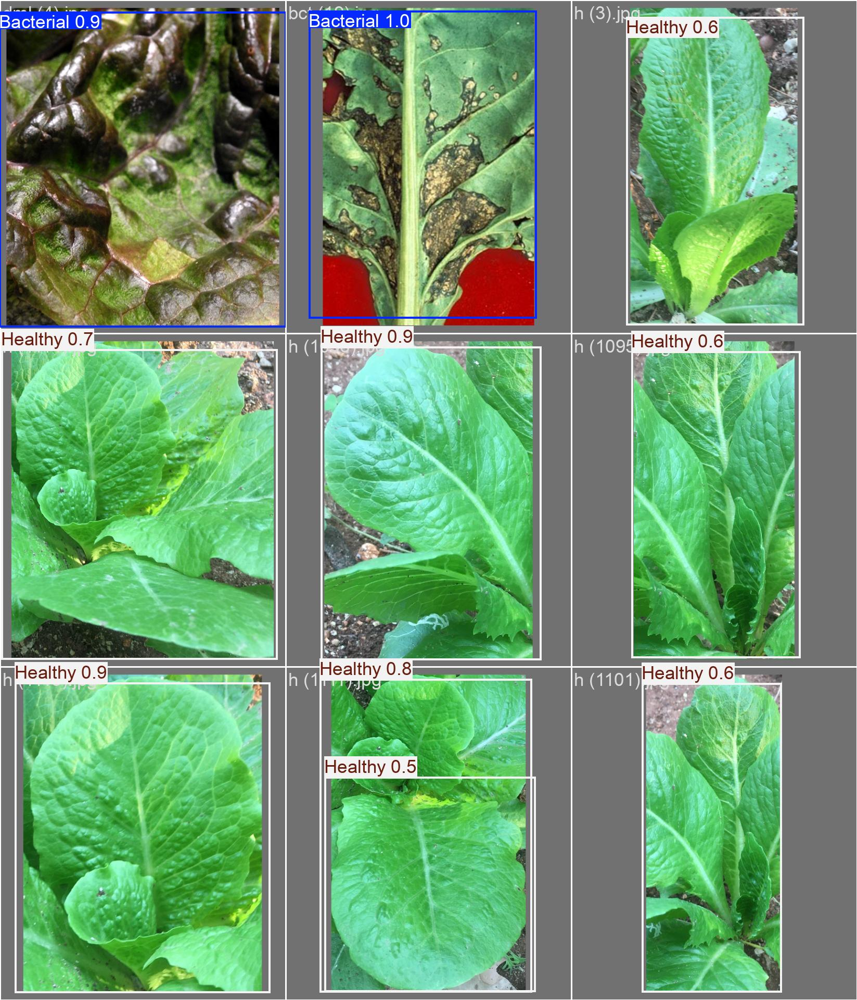

# 🥬 Lettuce Disease Detection using Deep Learning

This project focuses on detecting and classifying **diseases in lettuce leaves** using **deep learning-based object detection models**. The model identifies whether the lettuce is **Healthy** or affected by diseases like **Bacterial** or **Downy Mildew**.

---

## 📌 Project Overview
Plant diseases can drastically reduce crop yield and quality. Early detection is crucial for farmers to take timely preventive actions.  
In this project:
- A **custom dataset** of lettuce leaf images was prepared.
- **Deep learning models** were trained to classify and localize diseases.
- Predictions are visualized with **bounding boxes** and **confidence scores**.

---

## 📂 Repository Structure
```
├── Letuce disease.ipynb    # Jupyter Notebook with training & inference code
├── val_batch1_labels.jpg   # Ground truth labels visualization
├── val_batch1_pred.jpg     # Model predictions visualization
├── README.md               # Project documentation
```

---

## 🚀 Features
- Detects **Bacterial spots** and **Downy Mildew** in lettuce leaves.
- Classifies **Healthy** leaves.
- Provides **bounding boxes with confidence scores**.
- Visual comparison between **ground truth** and **predicted labels**.

---

## 🖼️ Sample Results
### ✅ Ground Truth (Labels)


### 🔍 Model Predictions


---

## ⚙️ Installation & Setup
1. Clone the repository:
   ```bash
   git clone https://github.com/your-username/lettuce-disease-detection.git
   cd lettuce-disease-detection
   ```

2. Install dependencies:
   ```bash
   pip install -r requirements.txt
   ```

3. Run the Jupyter notebook:
   ```bash
   jupyter notebook "Letuce disease.ipynb"
   ```

---

## 🧠 Model Training
- Dataset: Custom dataset of lettuce disease images.
- Model: Object detection (YOLOv5 / YOLOv8 or equivalent, depending on your notebook).
- Metrics: Confidence scores shown in predictions.
- Output: Predictions with bounding boxes and class labels.

---

## 📊 Results
- **Bacterial Spot**: Detected with high confidence (up to 1.0).
- **Downy Mildew**: Detected successfully in diseased leaves.
- **Healthy**: Correctly classified with confidence ranging from 0.5 to 0.9.

---

## 🛠️ Technologies Used
- Python
- YOLOv8
- PyTorch / TensorFlow (depending on notebook)
- OpenCV
- Matplotlib
- Jupyter Notebook

---

## 🌱 Future Improvements
- Expand dataset with more disease variations.
- Improve accuracy for low-confidence predictions.
- Deploy as a **web app** or **mobile app** for real-time detection.

---

## 🤝 Contribution
Contributions are welcome! Feel free to open an **issue** or submit a **pull request**.

---

## 📜 License
This project is licensed under the MIT License.

---

## 👤 Author
Developed by **Dipan Mazumder**  
📧 Contact: [dipanmazumder313@gmail.com]  
🌐 GitHub: [dipan313](https://github.com/dipan313)
